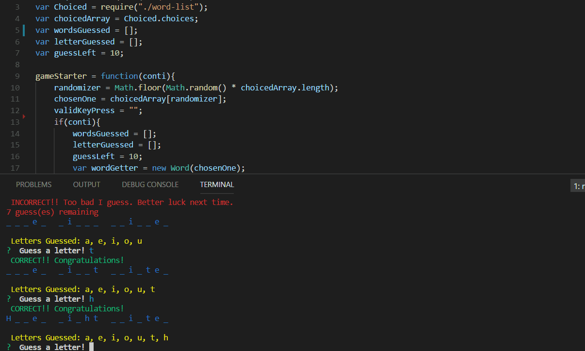

**Purpose**
To create a command line application that utilizes constructors stored in separate javascript files alongside the node package module `inquirer` for the purpose of a word guessing game.

The constructors are referenced by using node's `require`. A javascript file named `words-list` is also referenced, `words-list` stores random words to be randomly chosen by `index.js`.

**Installation/Keys**
`package.json` specifies the npm dependency required for this application to work. Run `npm install` on the command line, OR `npm install <package name(s) here>` for functionality.

**Word Guess Demo**
